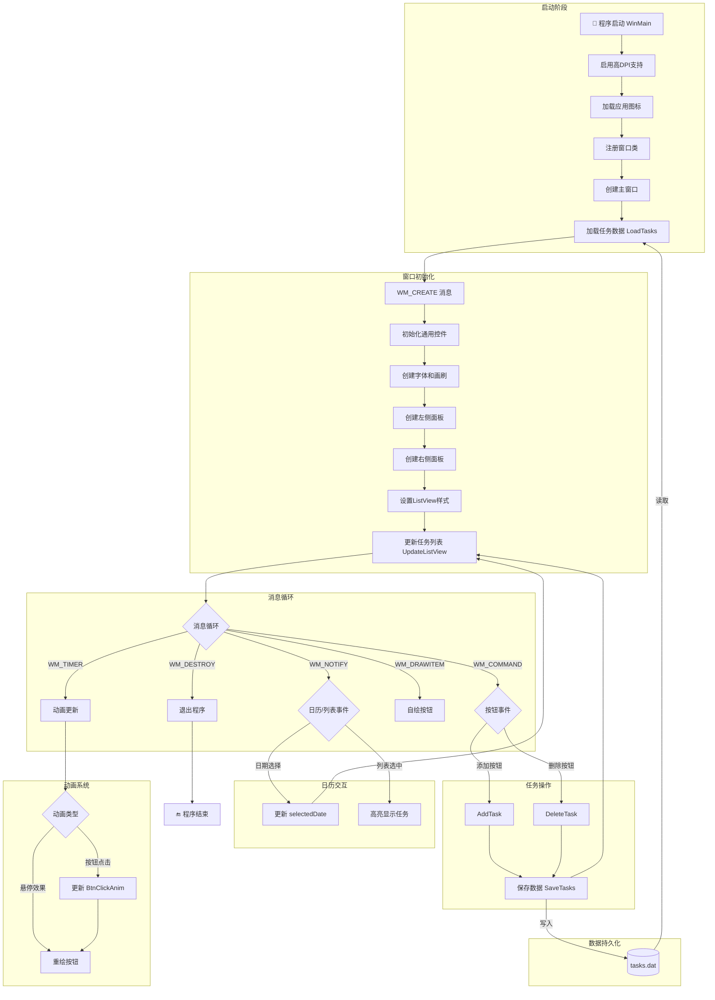
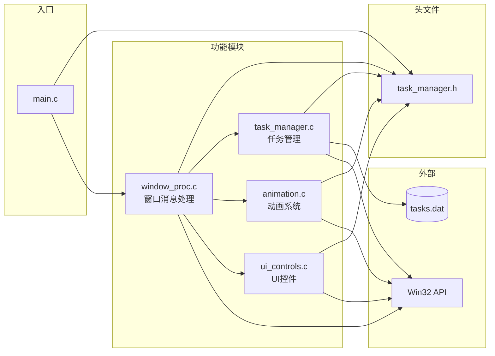

# 👁️ 任务管理器 - Task Manager

一个功能丰富、界面现代化的Windows桌面任务管理应用程序，采用原生C语言和Win32 API开发。

## 🔄 程序流程图



## 🔄 模块交互图



## ✨ 特色功能

### 📋 任务管理核心功能
- **📅 每日任务管理** - 基于日历的每日待办事项管理
- **📆 中期任务规划** - 中期项目和目标管理
- **🎯 长期目标追踪** - 长远规划和目标设定
- **⭐ 优先级标记** - 重要任务标识
- **🔥 紧急状态提醒** - 紧急任务高亮显示
- **⚠️ 逾期任务提醒** - 自动检测并显示过期未完成任务

### 🎨 现代化UI设计
- **💎 Material Design风格** - 清新的蓝白配色方案
- **🎪 圆角卡片布局** - 左右分栏的卡片式设计
- **✨ 平滑动画效果** - 按钮点击动画和悬停效果
- **🖼️ 高清图标支持** - 256x256自定义眼睛图标
- **🎯 高DPI适配** - 支持高分辨率显示器
- **🌈 交替行颜色** - ListView美化和自定义选中状态

### 📊 智能交互
- **📅 可视化日历** - 点击日期查看对应任务
- **📝 实时任务编辑** - 即时添加和删除任务
- **💾 自动数据持久化** - 任务数据自动保存到本地文件
- **🔍 分类视图** - 今日待办和长期规划分离显示

## 🚀 技术特点

- **🔧 纯C语言开发** - 使用C11标准，性能优异
- **🏗️ Win32原生API** - 直接调用Windows API，响应迅速
- **🎯 现代化字体** - 微软雅黑字体，清晰易读
- **💻 CMake构建系统** - 跨平台构建支持
- **📦 资源文件嵌入** - 图标和版本信息直接编译到exe中
- **🎪 主题样式支持** - 使用Windows Explorer样式
- **🧩 模块化架构** - 代码按功能分离，便于维护和扩展

## 📸 界面预览

应用程序采用双栏布局设计：
- **左侧面板**：日历选择器 + 任务输入区域
- **右侧面板**：今日待办 + 长期规划任务列表

### 🎨 配色方案
- 主背景：淡灰蓝 (#F5F7FB)
- 卡片背景：纯白 (#FFFFFF) 
- 主色调：明亮蓝 (#3B82F6)
- 悬停色：深蓝 (#2563EB)
- 危险色：红色 (#EF4444)

## 🛠️ 构建和运行

### 系统要求
- Windows 10/11 或更高版本
- Visual Studio 2022 或 MinGW-w64
- CMake 3.20 或更高版本

### 编译步骤

1. **克隆项目**
   ```bash
   git clone https://github.com/BassttElSevic/BassttProjectManage.git
   cd BassttProjectManage
   ```

2. **使用CMake构建**
   ```bash
   mkdir build
   cd build
   cmake ..
   cmake --build . --config Release
   ```

3. **或使用已配置的构建目录**
   ```bash
   cmake --build cmake-build-debug --config Debug
   ```

### 运行程序
```bash
cd cmake-build-debug
./untitled.exe
```

## 📁 项目结构

```
├── main.c                  # 程序入口
├── CMakeLists.txt          # CMake构建配置
├── resource.rc             # Windows资源文件
├── README.md               # 项目说明文档
│
├── Inc/                    # 头文件目录
│   └── task_manager.h      # 主头文件（类型定义、常量、函数声明）
│
├── Src/                    # 源文件目录
│   ├── task_manager.c      # 任务管理核心逻辑（增删改查、数据持久化）
│   ├── animation.c         # 动画系统（按钮点击动画、缓动函数）
│   ├── ui_controls.c       # UI控件（按钮子类化、ListView行高设置）
│   └── window_proc.c       # 窗口过程（消息处理、控件创建）
│
├── EYE_256x256.ico         # 高清应用图标
├── EYE_128x128.ico         # 中等尺寸图标
└── EYE_48x48.ico           # 小尺寸图标
```

## 🏗️ 模块说明

| 模块 | 文件 | 功能描述 |
|------|------|----------|
| **入口** | `main.c` | WinMain入口、窗口类注册、消息循环 |
| **头文件** | `Inc/task_manager.h` | 类型定义（Task、BtnClickAnim等）、常量、全局变量声明、函数原型 |
| **任务管理** | `Src/task_manager.c` | 任务的增删查、日期比较、文件读写 |
| **动画系统** | `Src/animation.c` | 按钮点击动画、缓动函数、圆角矩形绘制 |
| **UI控件** | `Src/ui_controls.c` | 按钮子类化处理、悬停效果、ListView自定义 |
| **窗口处理** | `Src/window_proc.c` | 窗口消息处理、控件创建与布局、自绘按钮 |

## 💾 数据存储

- **存储位置**：程序运行目录下的 `tasks.dat` 文件
- **存储格式**：二进制文件，包含任务数量和任务详情
- **自动保存**：添加或删除任务时自动保存

## 📝 更新日志

### v1.1.0 (2026-01-18)
- **🔧 代码重构** - 将单文件架构重构为模块化多文件结构
- **🐛 Bug修复** - 修复动画结构体的链接错误（LNK2019）
- **📦 类型定义优化** - 使用 typedef 定义 `BtnClickAnim` 和 `EditFocusAnim` 类型

### v1.0.0
- 初始版本发布
- 完整的任务管理功能
- 现代化UI界面
- 动画效果支持

## 📄 许可证

MIT License
