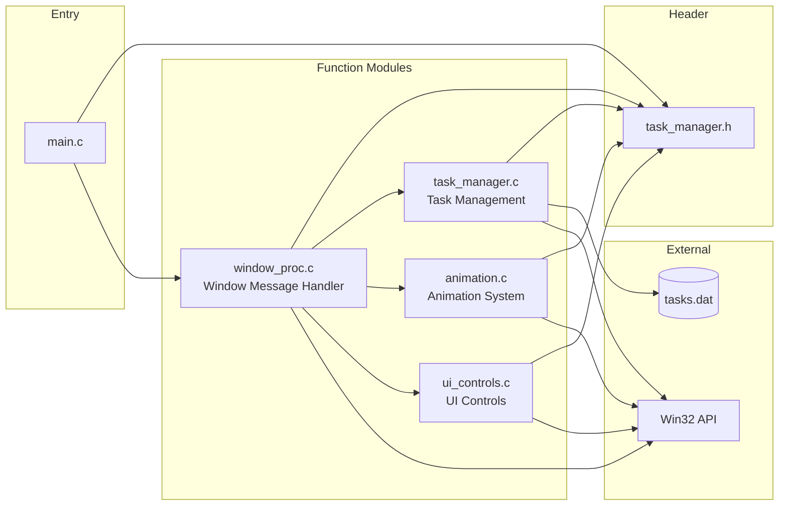

# 👁️ 任务管理器 - Task Manager

[English](#english) | [中文](#中文)

---

<a name="english"></a>
## 🌍 English

A feature-rich, modern Windows desktop task management application developed with native C language and Win32 API.

### 🔄 Program Flowchart

```mermaid
flowchart TD
    subgraph Startup Phase
        A[🚀 Program Start WinMain] --> B[Enable High DPI Support]
        B --> C[Load App Icon]
        C --> D[Register Window Class]
        D --> E[Create Main Window]
        E --> F[Load Task Data LoadTasks]
    end

    subgraph Window Initialization
        F --> G[WM_CREATE Message]
        G --> H[Initialize Common Controls]
        H --> I[Create Fonts and Brushes]
        I --> J[Create Left Panel]
        J --> K[Create Right Panel]
        K --> L[Setup ListView Styles]
        L --> M[Update Task List UpdateListView]
    end

    subgraph Message Loop
        M --> N{Message Loop}
        N -->|WM_COMMAND| O{Button Events}
        N -->|WM_NOTIFY| P{Calendar/List Events}
        N -->|WM_TIMER| Q[Animation Update]
        N -->|WM_DRAWITEM| R[Custom Draw Buttons]
        N -->|WM_DESTROY| S[Exit Program]
    end

    subgraph Task Operations
        O -->|Add Button| T[AddTask]
        O -->|Delete Button| U[DeleteTask]
        T --> V[Save Data SaveTasks]
        U --> V
        V --> M
    end

    subgraph Calendar Interaction
        P -->|Date Selection| W[Update selectedDate]
        W --> M
        P -->|List Selection| X[Highlight Task]
    end

    subgraph Animation System
        Q --> Y{Animation Type}
        Y -->|Button Click| Z[Update BtnClickAnim]
        Y -->|Hover Effect| AA[Redraw Button]
        Z --> AA
    end

    subgraph Data Persistence
        AB[(tasks.dat)] -->|Read| F
        V -->|Write| AB
    end

    S --> AC[🔚 Program End]
```



### 🔄 Module Interaction Diagram



### ✨ Features

#### 📋 Core Task Management
- **📅 Daily Task Management** - Calendar-based daily todo management
- **📆 Medium-term Planning** - Mid-term project and goal management
- **🎯 Long-term Goal Tracking** - Long-range planning and goal setting
- **⭐ Priority Marking** - Important task identification
- **🔥 Urgent Status Alerts** - Urgent task highlighting
- **⚠️ Overdue Reminders** - Auto-detect and display overdue tasks

#### 🎨 Modern UI Design
- **💎 Material Design Style** - Fresh blue-white color scheme
- **🎪 Rounded Card Layout** - Left-right split card design
- **✨ Smooth Animations** - Button click and hover effects
- **✨ Enhanced Calendar Animations** - Multi-layer glow, breathing effect, shimmer
- **🖼️ HD Icon Support** - 256x256 custom eye icon
- **🎯 High DPI Ready** - Support for high-resolution displays
- **🌈 Alternating Row Colors** - ListView beautification with custom selection

#### 📊 Smart Interaction
- **📅 Visual Calendar** - Click date to view corresponding tasks
- **📝 Real-time Editing** - Instant task addition and deletion
- **💾 Auto Data Persistence** - Tasks auto-saved to local file
- **🔍 Categorized View** - Separate daily and long-term task display

### 🚀 Technical Highlights

- **🔧 Pure C Development** - C11 standard, excellent performance
- **🏗️ Native Win32 API** - Direct Windows API calls, fast response
- **🎯 Modern Fonts** - Microsoft YaHei font, clear and readable
- **💻 CMake Build System** - Cross-platform build support
- **📦 Embedded Resources** - Icons and version info compiled into exe
- **🎪 Theme Support** - Windows Explorer style
- **🧩 Modular Architecture** - Code separated by function for easy maintenance

### 🎨 Color Scheme
- Main Background: Light Gray-Blue (#F5F7FB)
- Card Background: Pure White (#FFFFFF)
- Primary Color: Bright Blue (#3B82F6)
- Hover Color: Deep Blue (#2563EB)
- Danger Color: Red (#EF4444)

### 🛠️ Build and Run

#### System Requirements
- Windows 10/11 or higher
- Visual Studio 2022 or MinGW-w64
- CMake 3.20 or higher

#### Build Steps

1. **Clone the project**
   ```bash
   git clone https://github.com/BassttElSevic/BassttProjectManage.git
   cd BassttProjectManage
   ```

2. **Build with CMake**
   ```bash
   mkdir build
   cd build
   cmake ..
   cmake --build . --config Release
   ```

3. **Or use the configured build directory**
   ```bash
   cmake --build cmake-build-debug --config Debug
   ```

#### Run the Program
```bash
cd cmake-build-debug
./untitled.exe
```

### 📁 Project Structure

```
├── main.c                  # Program entry
├── CMakeLists.txt          # CMake build configuration
├── resource.rc             # Windows resource file
├── README.md               # Project documentation
│
├── Inc/                    # Header files directory
│   └── task_manager.h      # Main header (types, constants, declarations)
│
├── Src/                    # Source files directory
│   ├── task_manager.c      # Task management core (CRUD, persistence)
│   ├── animation.c         # Animation system (button click, easing)
│   ├── ui_controls.c       # UI controls (button subclass, ListView)
│   └── window_proc.c       # Window procedure (messages, controls)
│
├── EYE_256x256.ico         # High-res app icon
├── EYE_128x128.ico         # Medium-size icon
└── EYE_48x48.ico           # Small-size icon
```

### 🏗️ Module Description

| Module | File | Description |
|--------|------|-------------|
| **Entry** | `main.c` | WinMain entry, window class registration, message loop |
| **Header** | `Inc/task_manager.h` | Type definitions (Task, BtnClickAnim), constants, declarations |
| **Task Manager** | `Src/task_manager.c` | Task CRUD, date comparison, file I/O |
| **Animation** | `Src/animation.c` | Button click animation, easing functions, rounded rectangles |
| **UI Controls** | `Src/ui_controls.c` | Button subclassing, hover effects, ListView customization |
| **Window Proc** | `Src/window_proc.c` | Window message handling, control creation, custom drawing |

### 💾 Data Storage

- **Location**: `tasks.dat` file in the program directory
- **Format**: Binary file containing task count and task details
- **Auto-save**: Automatically saved when adding or deleting tasks

---

<a name="中文"></a>
## 🇨🇳 中文

一个功能丰富、界面现代化的Windows桌面任务管理应用程序，采用原生C语言和Win32 API开发。

### 🔄 程序流程图

```mermaid
flowchart TD
    subgraph 启动阶段
        A[🚀 程序启动 WinMain] --> B[启用高DPI支持]
        B --> C[加载应用图标]
        C --> D[注册窗口类]
        D --> E[创建主窗口]
        E --> F[加载任务数据 LoadTasks]
    end

    subgraph 窗口初始化
        F --> G[WM_CREATE 消息]
        G --> H[初始化通用控件]
        H --> I[创建字体和画刷]
        I --> J[创建左侧面板]
        J --> K[创建右侧面板]
        K --> L[设置ListView样式]
        L --> M[更新任务列表 UpdateListView]
    end

    subgraph 消息循环
        M --> N{消息循环}
        N -->|WM_COMMAND| O{按钮事件}
        N -->|WM_NOTIFY| P{日历/列表事件}
        N -->|WM_TIMER| Q[动画更新]
        N -->|WM_DRAWITEM| R[自绘按钮]
        N -->|WM_DESTROY| S[退出程序]
    end

    subgraph 任务操作
        O -->|添加按钮| T[AddTask]
        O -->|删除按钮| U[DeleteTask]
        T --> V[保存数据 SaveTasks]
        U --> V
        V --> M
    end

    subgraph 日历交互
        P -->|日期选择| W[更新 selectedDate]
        W --> M
        P -->|列表选中| X[高亮显示任务]
    end

    subgraph 动画系统
        Q --> Y{动画类型}
        Y -->|按钮点击| Z[更新 BtnClickAnim]
        Y -->|悬停效果| AA[重绘按钮]
        Z --> AA
    end

    subgraph 数据持久化
        AB[(tasks.dat)] -->|读取| F
        V -->|写入| AB
    end

    S --> AC[🔚 程序结束]
```

### 🔄 模块交互图

```mermaid
flowchart LR
    subgraph 入口
        A[main.c]
    end

    subgraph 头文件
        B[task_manager.h]
    end

    subgraph 功能模块
        C[window_proc.c<br/>窗口消息处理]
        D[task_manager.c<br/>任务管理]
        E[animation.c<br/>动画系统]
        F[ui_controls.c<br/>UI控件]
    end

    subgraph 外部
        G[(tasks.dat)]
        H[Win32 API]
    end

    A --> B
    A --> C
    C --> B
    C --> D
    C --> E
    C --> F
    D --> B
    D --> G
    E --> B
    F --> B
    C --> H
    D --> H
    E --> H
    F --> H
```

### ✨ 特色功能

#### 📋 任务管理核心功能
- **📅 每日任务管理** - 基于日历的每日待办事项管理
- **📆 中期任务规划** - 中期项目和目标管理
- **🎯 长期目标追踪** - 长远规划和目标设定
- **⭐ 优先级标记** - 重要任务标识
- **🔥 紧急状态提醒** - 紧急任务高亮显示
- **⚠️ 逾期任务提醒** - 自动检测并显示过期未完成任务

#### 🎨 现代化UI设计
- **💎 Material Design风格** - 清新的蓝白配色方案
- **🎪 圆角卡片布局** - 左右分栏的卡片式设计
- **✨ 平滑动画效果** - 按钮点击动画和悬停效果
- **✨ 强化日历动画** - 多层次辉光、呼吸效果、闪光动画
- **🖼️ 高清图标支持** - 256x256自定义眼睛图标
- **🎯 高DPI适配** - 支持高分辨率显示器
- **🌈 交替行颜色** - ListView美化和自定义选中状态

#### 📊 智能交互
- **📅 可视化日历** - 点击日期查看对应任务
- **📝 实时任务编辑** - 即时添加和删除任务
- **💾 自动数据持久化** - 任务数据自动保存到本地文件
- **🔍 分类视图** - 今日待办和长期规划分离显示

### 🚀 技术特点

- **🔧 纯C语言开发** - 使用C11标准，性能优异
- **🏗️ Win32原生API** - 直接调用Windows API，响应迅速
- **🎯 现代化字体** - 微软雅黑字体，清晰易读
- **💻 CMake构建系统** - 跨平台构建支持
- **📦 资源文件嵌入** - 图标和版本信息直接编译到exe中
- **🎪 主题样式支持** - 使用Windows Explorer样式
- **🧩 模块化架构** - 代码按功能分离，便于维护和扩展

### 🎨 配色方案
- 主背景：淡灰蓝 (#F5F7FB)
- 卡片背景：纯白 (#FFFFFF) 
- 主色调：明亮蓝 (#3B82F6)
- 悬停色：深蓝 (#2563EB)
- 危险色：红色 (#EF4444)

### 🛠️ 构建和运行

#### 系统要求
- Windows 10/11 或更高版本
- Visual Studio 2022 或 MinGW-w64
- CMake 3.20 或更高版本

#### 编译步骤

1. **克隆项目**
   ```bash
   git clone https://github.com/BassttElSevic/BassttProjectManage.git
   cd BassttProjectManage
   ```

2. **使用CMake构建**
   ```bash
   mkdir build
   cd build
   cmake ..
   cmake --build . --config Release
   ```

3. **或使用已配置的构建目录**
   ```bash
   cmake --build cmake-build-debug --config Debug
   ```

#### 运行程序
```bash
cd cmake-build-debug
./untitled.exe
```

### 📁 项目结构

```
├── main.c                  # 程序入口
├── CMakeLists.txt          # CMake构建配置
├── resource.rc             # Windows资源文件
├── README.md               # 项目说明文档
│
├── Inc/                    # 头文件目录
│   └── task_manager.h      # 主头文件（类型定义、常量、函数声明）
│
├── Src/                    # 源文件目录
│   ├── task_manager.c      # 任务管理核心逻辑（增删改查、数据持久化）
│   ├── animation.c         # 动画系统（按钮点击动画、缓动函数）
│   ├── ui_controls.c       # UI控件（按钮子类化、ListView行高设置）
│   └── window_proc.c       # 窗口过程（消息处理、控件创建）
│
├── EYE_256x256.ico         # 高清应用图标
├── EYE_128x128.ico         # 中等尺寸图标
└── EYE_48x48.ico           # 小尺寸图标
```

### 🏗️ 模块说明

| 模块 | 文件 | 功能描述 |
|------|------|----------|
| **入口** | `main.c` | WinMain入口、窗口类注册、消息循环 |
| **头文件** | `Inc/task_manager.h` | 类型定义（Task、BtnClickAnim等）、常量、全局变量声明、函数原型 |
| **任务管理** | `Src/task_manager.c` | 任务的增删查、日期比较、文件读写 |
| **动画系统** | `Src/animation.c` | 按钮点击动画、缓动函数、圆角矩形绘制 |
| **UI控件** | `Src/ui_controls.c` | 按钮子类化处理、悬停效果、ListView自定义 |
| **窗口处理** | `Src/window_proc.c` | 窗口消息处理、控件创建与布局、自绘按钮 |

### 💾 数据存储

- **存储位置**：程序运行目录下的 `tasks.dat` 文件
- **存储格式**：二进制文件，包含任务数量和任务详情
- **自动保存**：添加或删除任务时自动保存

---

## 📝 Changelog / 更新日志

### v1.2.0 (2025-01-19)
- **📝 Code Documentation / 代码注释** - Added detailed Chinese comments for all calendar animation functions / 为所有日历动画函数添加了详细的中文注释
- **🎯 Animation Analysis / 动画分析** - Documented issues and improvement suggestions for calendar animations / 记录了日历动画的问题点和改进建议
- **📖 Developer Friendly / 开发者友好** - Function comments include: purpose, parameters, implementation principle, and known issues / 函数注释包含：功能说明、参数说明、实现原理、已知问题

### v1.1.0 (2025-01-18)
- **🔧 Code Refactoring / 代码重构** - Refactored from single-file to modular multi-file structure / 将单文件架构重构为模块化多文件结构
- **🐛 Bug Fix / Bug修复** - Fixed animation struct linking error (LNK2019) / 修复动画结构体的链接错误（LNK2019）
- **📦 Type Definition Optimization / 类型定义优化** - Used typedef for `BtnClickAnim` and `EditFocusAnim` / 使用 typedef 定义 `BtnClickAnim` 和 `EditFocusAnim` 类型
- **📄 Documentation / 文档更新** - Added bilingual README with Mermaid diagrams / 添加中英双语README和Mermaid流程图

### v1.0.0
- Initial release / 初始版本发布
- Complete task management features / 完整的任务管理功能
- Modern UI interface / 现代化UI界面
- Animation effects support / 动画效果支持

## 📄 License / 许可证

MIT License
